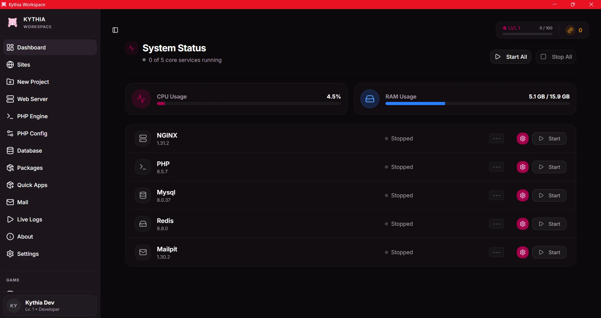

<p align="center">
  <br>
  
  <br>
</p>

<h1 align="center">Kythia Workspace</h1>

<p align="center">
  <strong>The Next-Generation Local Development Environment</strong><br>
  Blazingly fast, portable, and natively isolated.
</p>

<p align="center">
  <a href="https://github.com/kenndeclouv/kythia-workspace/blob/main/LICENSE">
    
  </a>
  <a href="https://v2.tauri.app/">
    
  </a>
  <a href="https://www.rust-lang.org/">
    
  </a>
  <a href="https://react.dev/">
    
  </a>
</p>

<p align="center">
  
</p>

---

## What is Kythia Workspace?

Kythia Workspace is a modern, ultra-lightweight alternative to legacy local environments like Laragon or XAMPP, and a faster, native alternative to containerized solutions like Docker Desktop. 

Built completely from the ground up using **[Tauri v2](https://v2.tauri.app/)**, **Rust**, and **React**, Kythia is designed around three core principles:
1. **Performance**: Minimal RAM consumption (~100-140MB) and instant startup times.
2. **Isolation**: Services run natively without polluting your system's global variables or Windows Services registry.
3. **Developer Experience**: A gorgeous, snappy UI that automatically configures complex things for you.

## Features

- **Microscopic Footprint**: Thanks to Rust and the OS-native WebView, Kythia consumes a fraction of the RAM used by Electron apps.
- **Native Service Orchestration**: Install, start, and stop multiple services independently with zero blocking UI issues. Supported out of the box:
  - **Web Servers**: Nginx
  - **Runtimes**: PHP (FastCGI)
  - **Databases**: MariaDB, MySQL, PostgreSQL, MongoDB
  - **In-Memory Caches**: Redis
  - **Utilities**: Mailpit (Local SMTP)
- **Auto-Configured Local Domains**: Say goodbye to `localhost:8080`. Kythia automatically writes to your `hosts` file and provisions an Nginx reverse proxy, allowing you to use beautiful `.test` domains instantly (or even make your own custom domain for local testing!).
- **System Tray Integration**: Quietly runs in the background. Use the mini-tray app to toggle services quickly without opening the main dashboard.
- **Smart Port Conflict Detection**: Never guess why MySQL won't start. Kythia scans for conflicting PIDs and notifies you if port 3306 or 80 is hijacked by another program (like Skype or Docker).
- **Ngrok Tunnels**: Share your local `.test` projects to the world instantly via integrated Ngrok tunnels.
- **Built-in Gamification**: Level up your developer profile! Earn XP and Kythia Coins by starting services, maintaining uptime, and unlocking achievements. Spend your coins in the Coin Store on custom themes, sound packs, and exclusive badges.

## Quick Start

### Prerequisites
- **Windows 10/11** (macOS and Linux support planned)
- [Bun](https://bun.sh/) (Fast all-in-one JavaScript runtime)
- [Rust](https://www.rust-lang.org/tools/install) (For building the core engine)

### Installation

1. **Clone the repository:**
   ```bash
   git clone https://github.com/kenndeclouv/kythia-workspace.git
   cd kythia-workspace
   ```
2. **Install dependencies:**
   ```bash
   bun install
   ```
3. **Run in Development Mode:**
   ```bash
   bun tauri dev
   ```
4. **Build Production Installer:**
   ```bash
   bun tauri build
   ```
   *This will generate a `.msi` and `.exe` installer in `src-tauri/target/release/bundle/`.*

## Data Directories

Kythia is designed to keep your system clean. All data is isolated:
- **Projects Root**: `C:\kythia\www` (default, configurable)
- **Settings**: `C:\kythia\data\settings.json`
- **Binaries**: Stored safely within the app directory, avoiding PATH pollution.

## Comprehensive Documentation

To truly master Kythia Workspace, please read the official documentation:
- [Architecture Details](docs/ARCHITECTURE.md) - Deep dive into how Rust handles process orchestration and IPC.
- [Usage Guide](docs/USAGE.md) - Step-by-step instructions on setting up domains, configuring ports, and reading logs.
- [Contributing](CONTRIBUTING.md) - Learn how to build Kythia locally and contribute back to the project.

## Contributing

We welcome community contributions! If you're a Rustacean, a React wizard, or just someone who found a bug, please check out our [Contributing Guidelines](CONTRIBUTING.md).

## License

Kythia Workspace is proudly open-source and released under the [MIT License](./LICENSE).