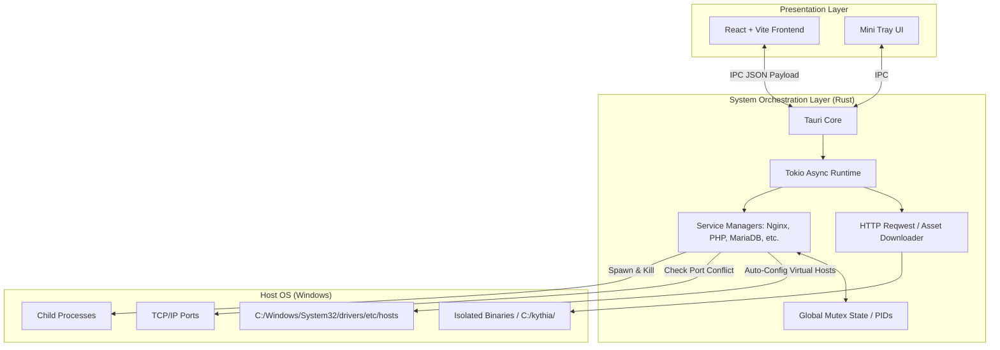

# System Architecture Document

Kythia Workspace is engineered from the ground up for maximum performance, memory safety, and modern aesthetics. It achieves this by shifting away from the bulky Electron framework and legacy C++ architectures, opting instead for a highly optimized Rust core and a lightweight Web View.

## High-Level System Architecture

Kythia is divided into two strict boundaries: the **Presentation Layer** and the **System Orchestration Layer**. They communicate exclusively via Tauri's secure Inter-Process Communication (IPC) bridge.

## System Orchestration Layer (Rust Backend)

The backend (`src-tauri/src/`) acts as the conductor of the environment. Unlike legacy stacks, **Kythia does not use blocking Windows Services (`services.msc`)**. Everything is orchestrated asynchronously.

### 1. Process Orchestration & Mutex State
When the user clicks "Start", the React UI sends an IPC command to Rust (e.g., `start_mariadb()`). 
- Rust uses `std::process::Command` to spawn the service binary as a detached child process.
- The resulting Process ID (PID) is safely stored in a thread-safe `Mutex` inside `state.rs`.
- Because Kythia holds the exact PID, it can gracefully kill the process tree when the user clicks "Stop" or closes the app, preventing "zombie processes" and port hijacking.

### 2. Smart Port Conflict Detection
Before starting a service, Kythia checks the required port (e.g., 3306 for MariaDB).
- If the port is busy, `check_port_conflicts()` uses OS APIs to retrieve the name and PID of the conflicting process (e.g., `mysqld.exe` from a rogue XAMPP installation).
- This is returned to the UI so the user can easily terminate the conflicting process.

### 3. Asynchronous Downloads & Extraction
The `downloader.rs` module uses `reqwest` and `tokio` to download heavy payloads (like MongoDB or PHP binaries) without freezing the UI.
- Downloads stream directly into zip extractors to save disk I/O.
- Binaries are kept strictly inside Kythia's internal paths to prevent polluting the global Windows PATH environment variable.

### 4. Local Domain Routing & Hosts Manipulation
To power "Pretty URLs" (e.g., `project.test`):
- `hosts.rs` directly manipulates `C:\Windows\System32\drivers\etc\hosts` (requiring administrative privileges) to point the custom domain to `127.0.0.1`.
- `sites.rs` generates a raw Nginx `.conf` block defining the Document Root (`C:\kythia\www\project`) and FastCGI proxies (for PHP routing).

## Presentation Layer (React Frontend)

The frontend (`src/`) is entirely decoupled from system operations.

### Live Polling
Since background services can crash (e.g., a bad `nginx.conf` or an OOM kill), the UI cannot assume a service is running just because it sent the "Start" command.
- The UI polls the backend every 2 seconds via `get_*_status()` commands.
- If Rust detects that the PID has died, it purges the state, and the React UI instantly reflects the crash by turning the indicator red.

### System Tray & Window Management
- **Main Dashboard**: The primary window where full configuration happens.
- **Tray Window**: A specialized, smaller Web View rendered when the user clicks the tray icon. It provides rapid access to Start/Stop functions.
- When the user closes the main window, `tauri::WindowEvent::CloseRequested` intercepts the event and hides the window instead, allowing background processes to continue serving web traffic seamlessly.

## Data Persistence & Settings

Settings are heavily typed in `settings.rs` and persisted directly to disk.
- **Configuration Path**: `C:\kythia\data\settings.json`
- **Default Document Root**: `C:\kythia\www`

This explicit separation of binaries (inside the app folder) and user data (`C:\kythia\`) guarantees that users can completely wipe or upgrade the Kythia application without ever losing their databases or web projects.
